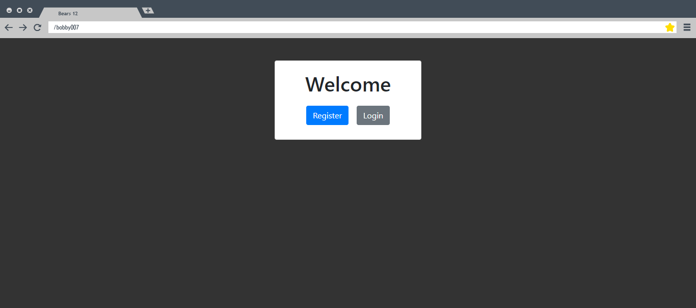
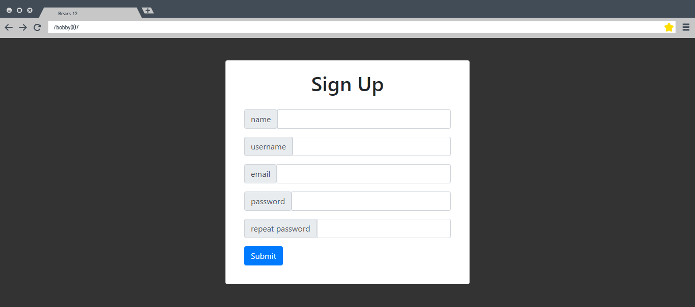
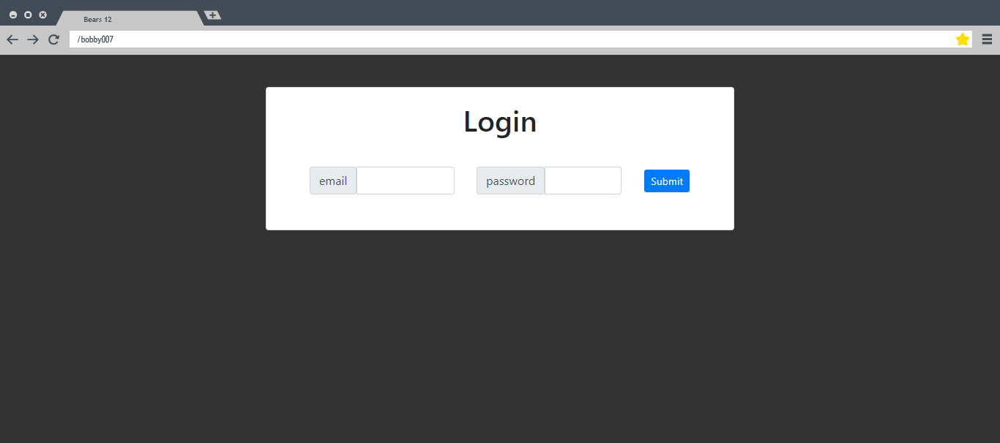
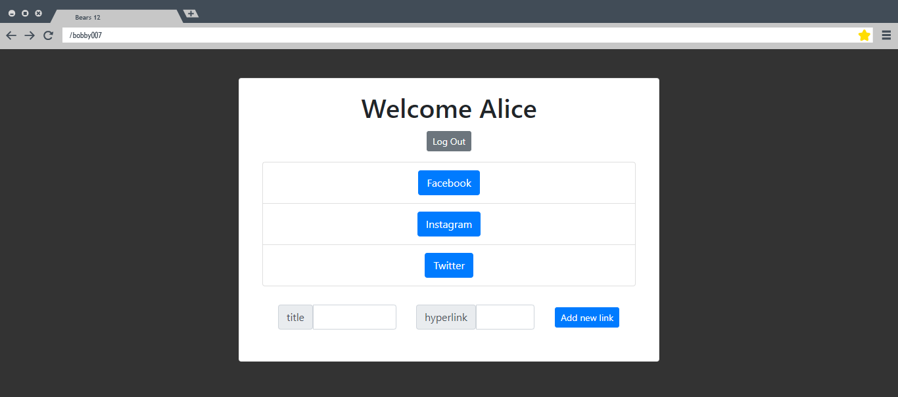
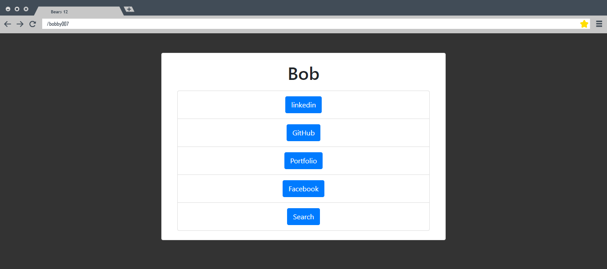

#

# Bears Team 12

This is an app (similar to Linktree) where you can create a profile with a list of links. Your profile can be shared to allow others to see your list of links in one place.

#

## LINKS

- [Backend Repo](https://github.com/chingu-voyages/v33-bears-team-12be)
- [Live Server](https://chingu-v33-b12-be.herokuapp.com/)
- [Live App](https://pensive-minsky-33f65a.netlify.app/)

#

## SKILLS USED

- React
- JWT-decode
- Axios
- Dotenv
- Javascript
- HTML / JSX
- CSS
- Bootstrap

#

## SCREENSHOTS

### Home Page:

The home page gives you the option to login or sign up for an account.

`path = '/'


### Sign Up Page:

`path = '/register'


### Login Page:

`path = '/login'


### Dashboard:

The Dashboard allows users to add links to their profile.

`path = '/dashboard'


### Public Profile Page:

The public profile lists a users links.

`path = '/:username'


#

## FUTURE FEATURES

- User settings
  - Edit password
  - Delete account
  - Themes
- Edit / Delete Links
- Link Icons
- Track Link Usage
- User Bio

#

## HOW TO INSTALL

- Fork and Clone this repo.
- run:

```
npm install
npm start
```

- See [Backend Repo](https://github.com/chingu-voyages/v33-bears-team-12be)
  for server instructions.
